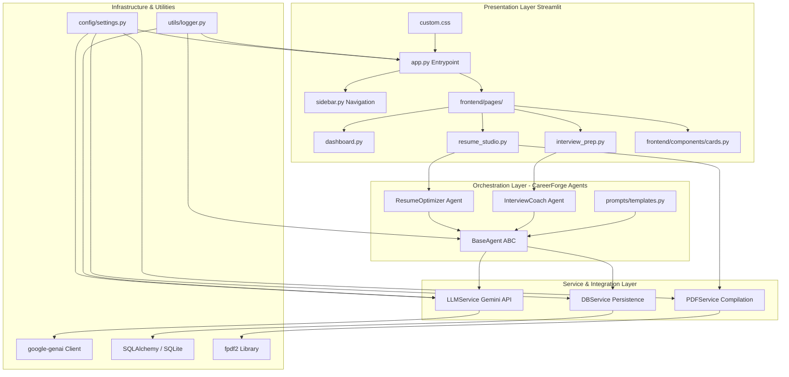

# Aeterna – Technical Architecture Design

This document details the software architecture, design patterns, and layer boundaries for **Aeterna – The Career Operating System**, powered by the **CareerForge Engine**.

---

## 🏛️ Architectural Overview

Aeterna is structured using a multi-layered **Clean Architecture** approach. This enforces separation of concerns, decouples core business policies from external APIs/UI layers, and ensures that individual parts of the system can be refactored, extended, or swapped without side effects.

---

## 🛡️ Layer Boundaries & Responsibilities

### 1. Presentation Layer (`frontend/`, `app.py`)
- **Main Entry Point (`app.py`)**: Configures Streamlit page state, injects global stylesheets (`custom.css`), configures logging, and acts as the root orchestrator.
- **Custom Sidebar (`frontend/components/sidebar.py`)**: A custom-designed navigation system that tracks the user's active cockpit selection and maintains user profiles.
- **Visual Components (`frontend/components/cards.py`)**: Implements reusable HTML widgets (like stats cards, action boards, and info panels) styled using custom CSS class tags.
- **Page Views (`frontend/pages/`)**: Contains pure visual lay-outs for specific modules. They take user inputs (e.g., resume uploads, text entries), trigger agent orchestration, and render output scorecards, download buttons, or conversation loops.

### 2. Cognitive Agent Layer (`agents/`, `prompts/`)
- **Base Agent (`agents/base_agent.py`)**: An abstract base class defining core constructors. It injects required services (`LLMService`, `DBService`) into agents, making testing straightforward.
- **Resume Optimizer (`agents/resume_optimizer.py`)**: Runs the prompt templates against candidates' resumes and job specs to find gaps and write strong Google XYZ bullets.
- **Interview Coach (`agents/interview_coach.py`)**: Manages conversational state, generates next interview questions based on history, and evaluates final transcripts.
- **Career Pathfinder (`agents/career_pathfinder.py`)**: Analyzes skill matrix transitions and constructs multi-stage career roadmaps.
- **Prompt Templates (`prompts/templates.py`)**: Decouples natural language instruction engineering from Python code.

### 3. Services Integration Layer (`services/`)
- **LLM Service (`services/llm_service.py`)**: Interfaces with the official `google-genai` SDK. It handles API authentication, target model parameters (e.g., `gemini-2.5-flash`), token usage, and provides fallback mock responses if keys are missing.
- **Database Service (`services/db_service.py`)**: Abstract client managing SQL read/writes for profiles, active applications, and conversational history.
- **PDF Service (`services/pdf_service.py`)**: Custom compiler using `fpdf2` that draws grids, headers, and footers, creating high-quality print resumes or transition reports.

### 4. Configurations & Core Utilities (`config/`, `utils/`)
- **Settings Controller (`config/settings.py`)**: Centralized type-safe environment loader. It validates that keys exist and provides a cached singleton instance of configurations.
- **Logger (`utils/logger.py`)**: Initialized at start. Uses `loguru` to stream colorized stdout logs to terminals and write compressed daily log files to disk.

---

## ⚡ Deployment Readiness on Streamlit Community Cloud

Streamlit Community Cloud expects a flat file structure. Aeterna satisfies these constraints by:
1. Keeping `app.py` at the root.
2. Keeping `requirements.txt` at the root, with pinned, cloud-compatible library versions.
3. Decoupling `.env` dependencies into `config/settings.py` so that they can be read directly from Streamlit's cloud **Secrets** configuration portal (as TOML parameters) without code changes.
4. Using an in-memory/SQLite database wrapper (`db_service.py`) by default, preventing failures if an external SQL cluster is unavailable.
